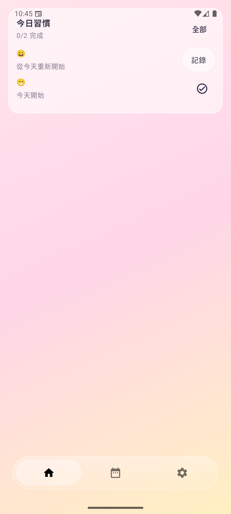

# MyDays

A habit-tracking Android app (daily habits, journaling, check-ins) built with a **soft "liquid glass" visual style** — and the primary testbed for an ongoing research project on **multi-agent, orchestrator-driven AI development workflows**.

This repo is genuinely early-stage as a *product* (see [Status](#status)). What it's further along on is the *process* it's being built with: most of the code here was produced by a self-designed team of AI sub-agents, coordinated by an orchestrator, with me acting as the reviewer/decision-maker rather than writing most of the code by hand.

## Screenshots

| Home | Habit check-in | Home widget |
|---|---|---|
|  |  |  |

## Tech stack

| Layer | Choice |
|---|---|
| Language | Kotlin |
| UI | Jetpack Compose + Material3 |
| Architecture | MVVM + Clean Architecture (early) |
| DI | Koin |
| Local storage | Room |
| Remote sync | Firebase Firestore (offline-first) |
| Auth | Firebase Authentication (Google Sign-In) |
| Background work | WorkManager / AlarmManager (habit reminders) |
| Extras | Home screen widget (Glance), notifications |

## What I'm actually researching here

The app is the output; the interesting part to me is the workflow that produced it. I designed a small "crew" of AI sub-agents, each with a narrow role, coordinated by an orchestrator that decides on its own when to invoke which agent:

- **Orchestrator ("First Officer")** — takes a task in plain language, plans the work, decides which agents to call and in what order, auto-retries failing tests/builds within limits, and only escalates to me for decisions that are risky, architectural, or destructive (e.g. touching a public API, deleting >100 lines, a schema change).
- **PMM Agent** (PM + Tech Lead) — turns a request into a spec and acceptance criteria, chooses the technical approach, flags risk.
- **Engineer Agent** — implements against the spec, writes tests, fixes its own failures.
- **QA Agent** — tests against the acceptance criteria, reports bugs with repro steps, checks against project conventions.
- **UI Designer Agent** — builds screens as previewable Compose components (`@Preview`) *before* they're wired up, so I can see and approve the look/feel before any ViewModel or data-layer code is touched.

Every task produces a paper trail under `.claude/outputs/<task>/`: `spec.md`, `ac.md`, `implementation.md`, `test-report.md`. `CONVENTIONS.md` accumulates decisions we don't want to re-litigate, each with a dated "why."

Specific questions I'm trying to answer with this project:

1. **Cross-project workflow switching** — can I give an agent a task in one project/folder and productively switch to a different project while it works, then come back? (This repo is checked out twice — `myday-work1` as the active workspace, `myday-work2` reserved — specifically to test this.)
2. **Orchestrator vs. fixed pipeline** — is it better for a main agent to *decide* which sub-agent to call next and why, versus a hard-coded PM→Engineer→QA sequence?
3. **A dedicated UI/UX sub-agent** — does separating "what it should look like" (previewable, no wiring) from "how it's implemented" produce a better development flow for product-shaped work?
4. **Spec-driven flow** — which parts of a spec-first process (written AC, structured handoff docs between agents) actually pay off versus add ceremony?

## Status

Early. The app currently has: Google sign-in, habit CRUD, daily check-in with streaks, offline-first Room↔Firestore sync, per-habit reminder notifications, and a home screen widget. Navigation and some screens are still being reshaped as the underlying agent workflow itself evolves — this is a live research project, not a finished product, and I'm not trying to present it as one.

## Running it

```bash
./gradlew :app:assembleDebug
adb install app/build/outputs/apk/debug/app-debug.apk
```

Requires your own `google-services.json` (Firebase project) dropped into `app/`.
